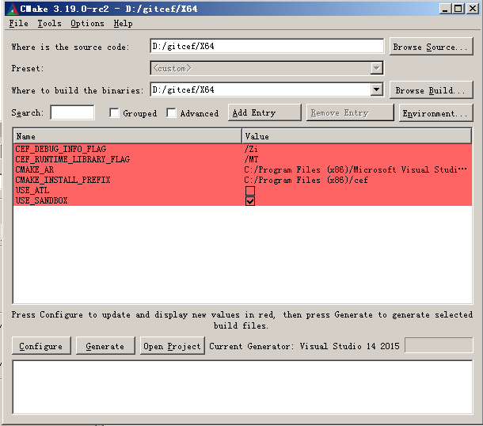
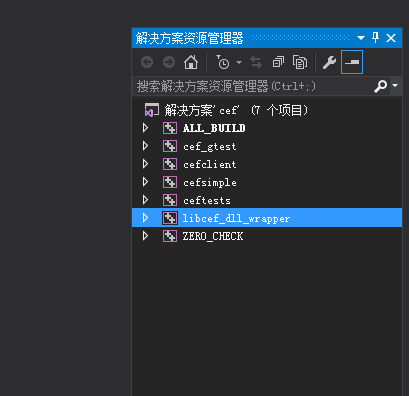
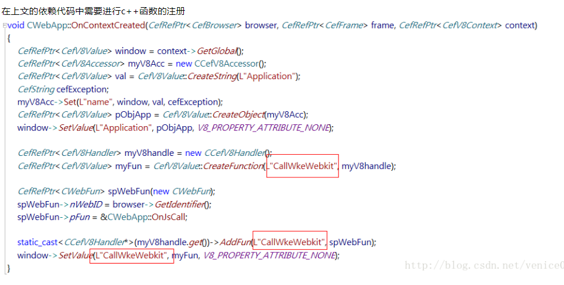

# libcef 使用指南 

应用场景

嵌入一个兼容HTML5的浏览器控件到一个已经存在的本地应用。
创建一个轻量化的壳浏览器，用以托管主要用Web技术开发的应用。
有些应用有独立的绘制框架，使用CEF对Web内容做离线渲染。
使用CEF做自动化Web测试。


## 1 下载和建立项目

### 1 下载

http://opensource.spotify.com/cefbuilds/index.html


###  2 cmake-gui 生成vs 项目






cefsimple :  libcef_dll_wrapper.lib , libcef.lib 


### 3  建立项目过程

1、 首先就是建一个空的win32项目，例如名字为TestLibCef 

2、 cefsimple目录（注意是拷贝文件夹）拷贝到新工程下并包含在项目中 

3、 并在TestLibCef\TestLibCef文件夹下，新建一个dll文件夹，Debug目录下的文件全部拷贝到该文件夹下

4、 把resource目录下的文件全部拷贝到该文件夹下（**TestLibCef\TestLibCef\dll**）

5、把include文件夹拷贝到该文件夹下（注意是拷贝文件夹）（**TestLibCef\TestLibCef\dll**）

6、libcef_dll_wrapper.lib文件拷贝到该文件夹下（**TestLibCef\TestLibCef\dll**）
(如果你要发布你的应用程序了，那么你就应该拷贝相应的release目录下的文件) 

7、在工程中添加一些头文件和源文件

8、 TestLibCef属性，附加包含目录  **TestLibCef\TestLibCef\dll**  +TestLibCef\TestLibCef

9、 C/C++下代码生成中，运行库改为“**多线程调试MTD**” ,预编译头：不使用预编译头	

10、 链接器，常规，附加库目录为：   C:\Program Files (x86)\Windows Kits\10\Lib\10.0.1015**0.0\ucrt\x86** 

11、 链接器，输入， 

 D:\test\TestLibCef\TestLibCef\dll\libcef_dll_wrapper.lib 

D:\test\TestLibCef\TestLibCef\dll\libcef.lib 

D:\test\TestLibCef\TestLibCef\dll\cef_sanbox.lib 

12、链接器 -高级-目标计算机   

13、 关闭VS2015；
打开VS2015软件（不点击任何解决方案）；
选择 **文件** ->**打开** ->**项目**， 找到之前建立的TestLibCef的sln文件。 

## 2 SimpleApp 简单例子


CefEnableHighDPISupport();   

void* sandbox_info = NULL;   

 main_args(hInstance);   # 命令行参数

##### **1 创建应用类**

CefRefPtr<SimpleApp> **app**(new SimpleApp);    *// 创建CefRef实例，SimpleApp implements application-level callbacks* 

​		CefSettings settings;   **settings**.no_sandbox = true;  // 设置没有沙盒*

​		CefWindowInfo **window_info**;  window_info.SetAsPopup(NULL, L"百度"); window_info.SetTransparentPainting(FALSE);    //设置window 窗口*

​		CefBrowserSettings **browser_settings**:: DefaultEncoding,UserStyleSheetLocation*
*RemoteFonts,JavaScript,JavaScriptOpenWindows* 

##### **2 初始化CEF** 

**CefInitialize**(main_args, settings, **app.get(),** sandbox_info);   // 

​                    初始化完之后调用simpleApp的OnContextInitialized 

                     ```C++
  // SimpleHandler implements browser-level callbacks. 实现浏览器级别的回调
  CefRefPtr<SimpleHandler> handler(new SimpleHandler(use_views)); 例如onBeforeClose

  // Specify CEF browser settings here.   设置browser 
  CefBrowserSettings browser_settings;
 有视图
      //创建浏览器视图.
    CefRefPtr<CefBrowserView> **BROWSER_VIEW** = CefBrowserView::CreateBrowserView(
        handler, url, browser_settings, nullptr, nullptr,
        new SimpleBrowserViewDelegate());
    // 创建窗口 Create the Window. It will show itself after creation.
    CefWindow::CreateTopLevelWindow(new SimpleWindowDelegate(  **BROWSER_VIEW** ));
 无视图
    CefWindowInfo window_info;
    window_info.SetAsPopup(NULL, "cefsimple");
    CefBrowserHost::CreateBrowser(window_info, handler, url, browser_settings,
                                  nullptr, nullptr);

                     ```

##### 3 消息循环关闭

CefRunMessageLoop();   *// Shut down CEF.* 

CefShutdown(); 


##### 4  SimpleHandler 说明

ExampleCefHandler 继承的handler 如下:

​          CefClient,   CefContextMenuHandler,   CefDisplayHandler, cefDownloadHandler,  CefDragHandler,    CefGeolocationHandler,  CefKeyboardHandler,                          public CefLifeSpanHandler,   CefLoadHandler,CefRequestHandler

实现的接口：

```c++
void ExampleCefHandler::OnAfterCreated(CefRefPtr<CefBrowser> browser) {
  REQUIRE_UI_THREAD();
  AutoLock lock_scope (this);

  this->browser = browser;

  CefLifeSpanHandler::OnAfterCreated (browser);
}

CefRefPtr<CefBrowser> ExampleCefHandler::GetBrowser () {   return browser; } 
修改 关闭前
void ExampleCefHandler::OnBeforeClose(CefRefPtr<CefBrowser> browser) 
 {  
     REQUIRE_UI_THREAD();  
     AutoLock lock_scope (this);   browser = NULL;  
     PostMessage(application_message_window_handle, WM_COMMAND, QUIT_CEF_EXAMPLE, 0);   
     CefLifeSpanHandler::OnBeforeClose (browser);
 } 
修改browser title
OnTitleChange(CefRefPtr<CefBrowser> browser,const CefString& title) {
  CEF_REQUIRE_UI_THREAD();
  if (use_views_) {
    // Set the title of the window using the Views framework.
    CefRefPtr<CefBrowserView> browser_view = CefBrowserView::GetForBrowser(browser);
    if (browser_view) {
      CefRefPtr<CefWindow> window = browser_view->GetWindow();
      if (window)
        window->SetTitle(title);
    }
  } else {
    // Set the title of the window using platform APIs.
    PlatformTitleChange(browser, title);
  }
}
void OnAfterCreated(CefRefPtr<CefBrowser> browser) {browser_list_.push_back(browser);}

void SimpleHandler::OnBeforeClose(CefRefPtr<CefBrowser> browser) {
  // Remove from the list of existing browsers.
  BrowserList::iterator bit = browser_list_.begin();
  for (; bit != browser_list_.end(); ++bit) {
    if ((*bit)->IsSame(browser)) {
      browser_list_.erase(bit);
      break;
    }
  }
  if (browser_list_.empty()) CefQuitMessageLoop();
}

```


## 3 CefClient 例程


## 4 另外的例子

### 4.1自建窗口

https://blog.csdn.net/wangshubo1989/article/details/50199599

**WinMain**

   CefInitialize (main_args, settings, app.get()); 
   **CreateBrowserWindow** (hInstance, nCmdShow);      
   application_message_window_handle = **CreateMessageWindow** (hInstance); 

**CreateBrowserWindow** {

​        WNDCLASSEX wcex = { 0 }; 

​       wcex.lpfnWndProc   = **BrowserWindowWndProc**;
​      RegisterClassEx (&wcex);   

​      HWND window_handle (CreateWindow (BROWSER_WINDOW_CLASS, BROWSER_WINDOW_CLASS,    WS_OVERLAPPEDWINDOW | WS_CLIPCHILDREN, CW_USEDEFAULT, 0,  

}


 **BrowserWindowWndProc**  

 case WM_CREATE:         {            

​            example_cef_handler = new ExampleCefHandler(); 

​             RECT rect = { 0 };            

​             GetClientRect (window_handle, &rect);             

​             CefWindowInfo info;            

​            info.SetAsChild(window_handle, rect);             

​            CefBrowserSettings settings;            

​             CefBrowserHost::**CreateBrowser**(info, example_cef_handler.get(),             CefString ("http://www.google.com"), settings, NULL); 


 **MessageWindowWndProc** (HWND window_handle, UINT message, WPARAM w_param, LPARAM l_param) {   LRESULT result (0);   

switch (message)   {      

​	case WM_COMMAND:         {            

​                 if (w_param == QUIT_CEF_EXAMPLE)            

​                 {               

​                             PostQuitMessage(0); 


### 4.2另外一个例子  MFC 

https://blog.csdn.net/blackwoodcliff/article/details/74276848

十分详细


https://blog.csdn.net/gaga392464782/article/details/49490101

CefMFCApp::InitInstance()

```
CefRefPtr<clientApp> app(new clientApp);
CefExecuteProcess(main_args,app.get(),NULL);
setting.multi_threaded_message_loop = true ;
**CefInitialize**(main_args, settings, **app.get(),** sandbox_info); 
```

CefMFCApp::ExitInstance()

​       CefShutdown()

Dlg::OnCreate():

    CefWindowInfo window_info;
    window_info.SetAsPopup(NULL, "cefsimple");
    CefBrowserHost::CreateBrowser(window_info, handler, url, browser_settings,nullptr, nullptr);


## 5 CEF 基本功能


### 创建浏览器-浏览url 

std::wstring url = L"www.baidu.com";
CefBrowserHost::CreateBrowser(info, **g_web_browser_client**.get(), CefString(url), browserSettings, NULL);

std::wstring **url2** = "www.google.com"
CefRefPtr<CefBrowser> browser = **g_web_browser_client**->GetBrowser();
browser->GetMainFrame()->LoadURL(CefString(**url2**)); 


### 设置cookie

std::wstring **username_key** = L"username"*;*    

std::wstring **domain** = L"blog.csdn.net"     


CefRefPtr<CefCookieManager> **manager** = CefCookieManager::GetGlobalManager()*;*    

CefCookie cookie*;*    

CefString(&cookie.name).**FromWString**(**username_key**.c_str())*;*    CefString(&cookie.domain).FromWString(**domain**.c_str())*;*    

CefString(&cookie.path).FromASCII("/")*;*    


**cookie**.has_expires = false*;*     

**domain** = L"https://" + domain*;*    

CefPostTask(TID_IO, NewCefRunnableMethod(**manager**.get(),&CefCookieManager::SetCookie,CefString(domain.c_str()), **cookie**))*;*
 //创建浏览器    

CefBrowserHost::CreateBrowser(info, g_web_browser_client.get(), domain.c_str(), browserSettings, NULL)*;* 


### C++调用js

CefRefPtr<CefFrame> **frame** = browser->GetMainFrame(); 

frame->ExecuteJavaScript("alert('ExecuteJavaScript works!');",  frame->GetURL(), 0);

在本人的依赖中有 GetCefInstance()->RunJS(pTestWeb->GetWebID(), L"sendMessage", 1, JsDataStr.GetBuffer());

 第一个参数为该网页的ID号，第二个为js的函数名，第三个为总的参数个数，第四个为参数，详情请看源代码。


https://blog.csdn.net/mfcing/article/details/44539035?utm_source=blogxgwz6 


### JS调用C++函数




重写 CefRenderProcessHandler的OnContextCreated接口 

{

创建函数对象 并将JS函数绑定到C++函数指针上面的过程 

CefRefPtr<CefV8Handler> myV8handle = new CCefV8Handler();

CefRefPtr<CefV8Value> myFun = CefV8Value::CreateFunction(L"SetAppState", myV8handle);

static_cast<CCefV8Handler*>(myV8handle.get())->AddFun(L"SetAppState", &CChromeJsCallback::JsSetAppState);

​		pObjApp->SetValue(L"SetAppState", myFun, V8_PROPERTY_ATTRIBUTE_NONE);


## 6 其他

### 框架接口说明

CefBrowser是主要的浏览器窗口类，可以用静态的函数CreateBrowser() 和CreateBrowserSync() 来创建一个新的浏览器窗口。
CefFrame 代表一个浏览器窗口的框架，每个浏览器窗口有一个顶层的主框架，而这个主框架可以用GetMainFrame() 方法得到。
CefClient是主浏览器窗口的代表接口，这个接口做为参数传递给CreateBrowser()
CefRequest 代表URL，方法，发送数据和头文件等这样的请求。
CefSchemeHandleFactory 类是被用来处理像myscheme://mydomain类似客户计划的请求
CefReadHandler和CefWriteHandle是一个读写数据的简单接口。
CefV8Handler,CefV8Value和CefV8Context是被用来创建和访问JavaScript对象。 

### CefBrowser和CefFrame 方法

 Back, Forward, Reload and Stop Load。控件浏览器的导航
Undo, Redo, Cut, Copy, Paste, Delete, Select All.控件目标框架的选取
Print。打印目标框架
Get Source。以字符串的形式来获取目标框架的HTML源码
View Source. 用缓存文件来保存目的框架的HTML源码，并且用系统默认的文本查看器打开
Load URL.加载特定的URL到目标框架
Load String. 加载一个特定的字符串到目标框架，通过一个随意指定的虚拟URL
Load Stream. 加载一个特定的二进制文件到目标框架，通过一个随意指定的虚拟URL
Load Request, 加载一个特定的请求到目标框架
Execute JavaScript: 在目标框架里面执行一个特定的Javscript命令
Zoom。 缩放特定框架的网页内容 


### linux 错误处理

```
  XSetErrorHandler(XErrorHandlerImpl);
  XSetIOErrorHandler(XIOErrorHandlerImpl);
  
int XErrorHandlerImpl(Display *display, XErrorEvent *event) {
  LOG(WARNING)
        << "X error received: "
        << "type " << event->type << ", "
        << "serial " << event->serial << ", "
        << "error_code " << static_cast<int>(event->error_code) << ", "
        << "request_code " << static_cast<int>(event->request_code) << ", "
        << "minor_code " << static_cast<int>(event->minor_code);
  return 0;
}
```


调用例子

https://blog.csdn.net/gaga392464782/article/details/49490101

https://dabaojian.blog.csdn.net/article/details/50189577?utm_medium=distribute.pc_relevant.none-task-blog-BlogCommendFromMachineLearnPai2-2.channel_param&depth_1-utm_source=distribute.pc_relevant.none-task-blog-BlogCommendFromMachineLearnPai2-2.channel_param


