# 五分钟Apollo自动驾驶平台 


## 引言


Apollo Project 是为汽车和自主驾驶行业的合作伙伴提供开放，完整和可靠的软件平台。该项目的目的是使合作伙伴能够基于Apollo软件套件开发自己的自动驾驶系统。

参考：

https://github.com/ApolloAuto/apollo/blob/master/docs/technical_tutorial/apollo_3.0_technical_tutorial_cn.md

 https://zhuanlan.zhihu.com/p/91322837   


## 一、系统安装和使用

### 1.1 硬件安装

​    工业级PC  

```
例如： Neousys Nuvo-6108GC  Nuvo-6018GC is world's first industrial-grade GPU computer supporting high-end graphics cards.
            华硕 GTX1080 GPU-A8G-Gaming 显卡
            32GB DDR4 内存
            PO-280W-OW 280W AC/DC 电源适配器
            2.5" SATA磁盘 1TB 7200转/秒
```

​    全球定位系统（GPS）
​    惯性计算单元（IMU）
​    区域网络控制卡（CAN）

```
CAN（Controller Area Network）即控制器区域网络的缩写，它是一种开放式、数字化、多点通信的底层控制网络。用以连接控制应用系统或子系统内部的元器件、传感器和制动器的通信。这项最初由德国博士公司于1986年开发的多主通信协议，主要用于传输速率达1 Mbit/s，对数据完整性要求很高的汽车应用。今天大多数轿车制造商已经在CAN网络基础上，采用多路传输系统设计了发动机系统。 CAN应用于ECM（发动机）、TCM（自动驱动桥）、TCS（牵引力控制）通信。 CAN提供灵活的多主站总线结构和实时功能。

```

 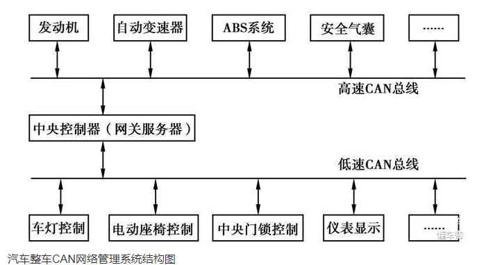

 

​    GPS天线+ GPS接收器

```
安装GPS接收器和天线:  以NovAtel SPAN-IGM-A1（带惯性传感器IMU,卡尔曼滤波器在基于gps位置进行校准基础上，使用惯性传感器对当前的位置进行实时预测, GPS与惯性传感器外，也会使用LiDAR点云与高精地图匹配，以及视觉里程计算法等定位方法 参见论文 Robust and Precise VehicleLocalization based on Multi-sensor Fusion in Diverse City Scenes  ），NovAtel GPS-703-GGG-HV 天线,
本安装指令描述了挂载、连接和为GPS-IMU NovAtel SPAN-IGM-A1量取和设置控制杆尺寸的步骤。
挂载  
    将GPS-IMU NovAtel SPAN-IGM-A1放置并固定在车辆内部，同时使Y轴指向前方。
    将NovAtel GPS-703-GGG-HV 天线挂载在车辆上方无遮挡的区域。

配线
    天线数据线将GNSS天线连接到SPAN-IGM-A1天线端口
    主数据线：
        将15-pin端连接到SPAN-IGM-A1
        连接电源线到一个10-to-30V DC电源
        连接用户端口到IPC.
        如果电源供应来自于车辆的电池，则需要额外增加一个辅助电池（推荐）。
    AUX线:
        连接AUX数据线到15-pin AUX端口
        如果USB端口用于数据传输，则连接USB数据线到IPC
```

​    激光雷达（LiDAR）

```
IMU +GPS 收发器+天线，构成惯性导航系统，通过USB 传输数据给processor， 同时，GPS 模块输出触发信号给Lidar模块，做信号同步， 最后做数据融合。
连线：
    连接电源线
    连接gps 
    连接IPC
```

 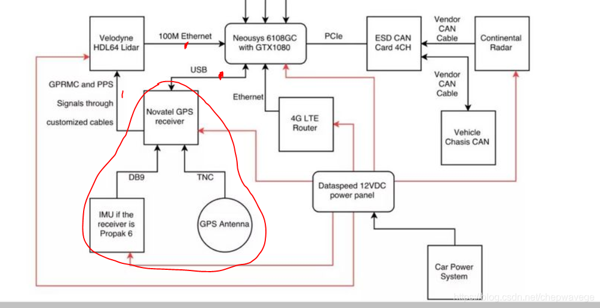 

​    摄像机： 推荐使用 6mm 和25mm两种焦距 ，以检测信号灯（ 不同的镜头mm数代表不同的焦距，mm数越大，则镜头的焦距越大，照射的距离越远，不过视角会越小。 ）
​    雷达：              

```
连接：    电源线连接，连接CAN ， 
    
激光雷达其分辨率和准确度均高于雷达。
雷达是无线电探测和测距的缩写，它使用无线电波来计算速度和/或距离,无线电波波长比激光雷达波大,与物体接触时的光波吸收相对较少（衰减较小），所以它们可以在较长的距离上工作和烟雾条件。
如果你的目标是在你面前探测一辆汽车（或朝你驾驶）并获得它的速度，雷达可能会很棒
如果您试图确定物品的准确位置，生成表面贴图或找到小型栅栏，LIDAR可能会做得更好
```

​    Apollo传感器单元（ASU）

```
ASU系统提供多种接口以收集来自不同传感器的数据，包括摄像机、激光雷达、雷达和超声波传感器。该系统同样使用GNSS接收器的秒脉冲（PPS）和GPRMC信号实现摄像机和激光雷达的数据收集同步。
ASU和IPC的通讯通过PCI Express接口。ASU收集传感器数据并通过PCI Express接口传输给IPC，IPC通过ASU发送车辆控制指令，该指令基于区域网络控制协议（CAN协议）。
前面板接口
    外部GPS PPS / GPRMC输入接口
    FAKRA摄像机数据输入接口（5个接口）
    10/100/1000M Base-T以太网接口（2个接口）
    KL-15 (AKA Car Ignite)信号输入接口
后面板接口
    通用UART接口（保留）
    外部PCI Express接口（支持X4或X8）连接IPC请使用EXTN
    GPS PPS / GPRMC输出接口（3个接口）
    连接Stereo Camera的电源和PPS/GPRMC输出接口
    CAN Bus（4个接口）
    主电源输入接口

```

其他安装：

使用DVI线或HDMI线连接显示器，并连接鼠标和键盘实现车辆现场调试功能。

在Apple iPad Pro上建立一个Wi-Fi连接以访问HMI和控制在IPC上运行的Apollo自动驾驶系统（ADS）。


### 1.2 软件安装和启动

1、基础软件

 Ubuntu Linux
 NVIDIA GPU Driver
 Docker Engine
 NVIDIA Container Toolkit

```
DOCKER_OPTS = "-s overlay"
```

2、安装apollo 

    下载，启动开发容器
    git clone git@github.com:ApolloAuto/apollo.git
    cd apollo
    git checkout master
    echo "export APOLLO_ROOT_DIR=$(pwd)" >> ~/.bashrc  && source ~/.bashrc
    
    bash docker/scripts/dev_start.sh  启动apollo docker 开发容器
        [ OK ] Congratulations! You have successfully finished setting up Apollo Dev Environment.
        [ OK ] To login into the newly created apollo_dev_michael container, please run the following command:
        [ OK ]   bash docker/scripts/dev_into.sh
        [ OK ] Enjoy!
    构建与启动
    bash docker/scripts/dev_into.sh
    ./apollo.sh build[build_opt]  
    
    # Startup modules monitor and dreamview, the default option is start.
    ./scripts/bootstrap.sh [start | stop | restart]

### 1.3 运行DEMO

3、 访问：  [http://localhost:8888](http://localhost:8888/)  

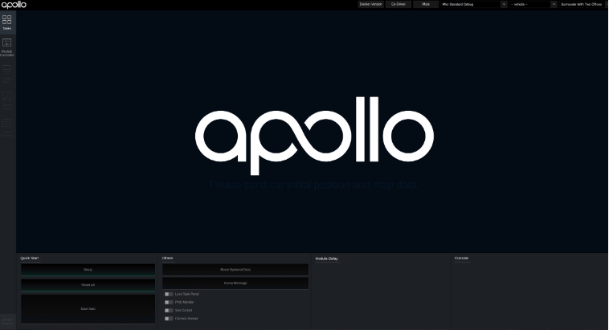

4、选择驾驶模式和地图

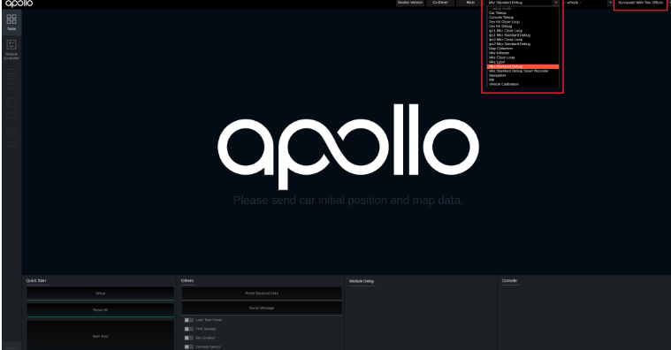

5、运行demo:

```
# You need to download the demo record using the following commands
cd docs/demo_guide/
python3 record_helper.py demo_3.5.record  # 下载demo 记录

# You can now replay this demo "record" in a loop with the '-l' flag
cyber_recorder play -f docs/demo_guide/demo_3.5.record -l # 回放
```


### 1.4 校准

多激光雷达全球导航卫星系统(Multiple-LiDAR GNSS)校准
在许多自动驾驶任务，如HDMap的制作，多个激光雷达扫描结果需要注册在一个统一的坐标系统。在这种情况下，需要对多个LIDARs的外部参数进行仔细校准。为了解决这个问题，开发了多激光雷达GNSS校准工具。

激光雷达校准
本服务作为Apollo整车传感器标定功能中的一部分，提供Velodyne 64线激光雷达HDL-64ES3与IMU之间的外参标定功能。标定结果可用于将激光雷达检测的障碍物转换至IMU坐标系，进而转到世界坐标系下。

传感器标定
相机到相机的标定，相机到多线激光雷达的标定，以及毫米波雷达到相机的标定。


坐标系

Apollo采用的是WGS84（World Geodetic System 1984）作为标准坐标系来表示物体的纬度和经度. 
ENU East-North-Up 局部坐标系依赖于在地球表面上建立的3D笛卡尔坐标系。 通用横轴墨卡托正形投影（Universal Transverse Mercator UTM）使用2D的笛卡尔坐标系来给出地球表面点的位置。这不仅只是一次地图的映射。该坐标系统将地球划分为60个区域，每个区域表示为6度的经度带，并且在每个区域上使用割线横轴墨卡托投影。在Apollo系统中，UTM坐标系统在定位、Planning等模块中作为局部坐标系使用。在Apollo系统中，UTM坐标系统在定位、Planning等模块中作为局部坐标系使用。

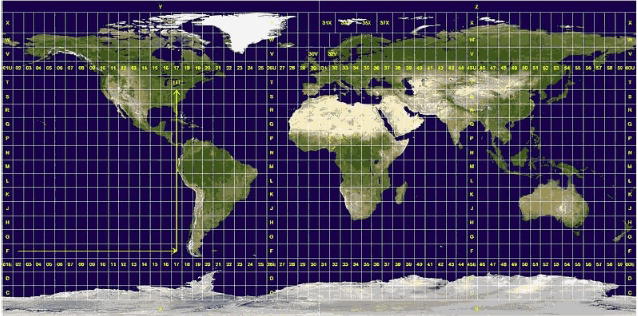

车辆坐标系 – 右-前-上（Right-Forward-Up RFU）
车辆坐标系的定义为：
z轴 – 通过车顶垂直于地面指向上方
y轴 – 在行驶的方向上指向车辆前方
x轴 – 面向前方时，指向车辆右侧

 车辆坐标系的原点在车辆后轮轴的中心。 

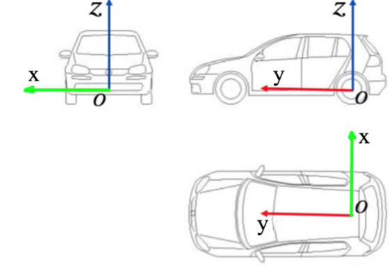

## 二、apollo 系统架构和原理

### 2.1 平台架构和系统结构

开放平台架构

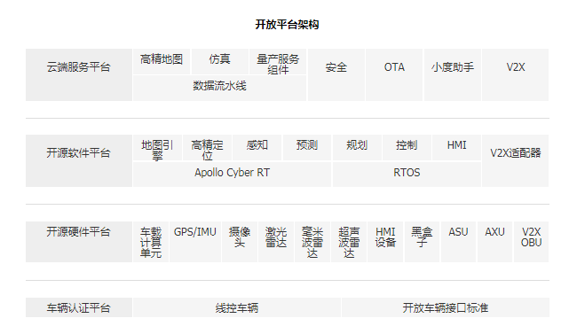

系统架构

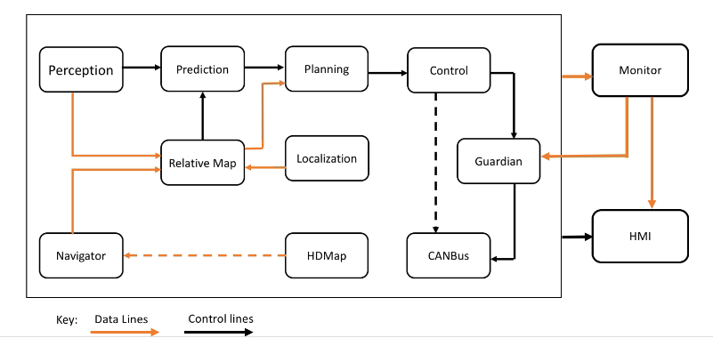

图中每个模块都作为单独的基于CarOS的ROS节点运行。每个模块节点都发布和订阅特定topic。订阅的topic用作数据输入，而发布的topic用作数据输出。 

### **2.2 感知perception** 

感知模块识别自动驾驶车辆周围的世界。感知中有两个重要的子模块：障碍物检测和交通灯检测。

```
感知依赖LiDAR点云数据和相机原始数据。除了这些传感器数据输入之外，交通灯检测依赖定位以及HD-Map。
    CIPV检测/尾随 
    全线支持 
    异步传感器融合 
    在线姿态估计 - 在出现颠簸或斜坡时确定与估算角度变化，以确保传感器随汽车移动且角度/姿态相应地变化。
    视觉定位
    超声波传感器 – 作为安全保障传感器，与Guardian一起用于自动紧急制动和停车。
```

#####  3D 障碍物感知

###### 高精地图ROI过滤器（HDMap ROI Filter）  

ROI（The Region of Interest）指从高精地图检索到包含路面、路口的可驾驶区域。高精地图 ROI 过滤器（往下简称“过滤器”）处理在ROI之外的激光雷达点，去除背景对象，如路边建筑物和树木等，剩余的点云留待后续处理。给定一个高精地图，每个激光雷达点的关系意味着它在ROI内部还是外部。 每个激光雷达点可以查询一个车辆周围区域的2D量化的查找表（LUT）

配置：

```
range	基于LiDAR传感器点的2D网格ROI LUT的图层范围），如(-70, 70)*(-70, 70)	70.0 米
cell_size	用于量化2D网格的单元格的大小。	0.25 米
extend_dist	从多边形边界扩展ROI的距离。	0.0 米
```
输入:   点云（激光雷达捕捉的3D点数据集）+高精地图（ 多边形集合，每个多边形均含有一个有序的点集）

输出: 由高精地图定义的ROI内的输入点索引。

处理:

1. 坐标转换    将输入点云和HDMap多边形变换为来自激光雷达传感器位置的地方坐标系。

2. ROI LUT构造

   Apollo采用网格显示查找表（LUT），将ROI量化为俯视图2D网格，以此决定输入点是在ROI之内还是之外。为了计算效率，Apollo使用 **扫描线算法**和 **位图编码**来构建ROI LUT

   ```
   扫描线算法思想：
   用Y轴从左往右扫描，用这次碰边的 x xx 坐标减去上一次碰边时的 x xx 坐标，再用这个差值乘以当前 y yy 轴上有多少个点被覆盖
   ```

   

   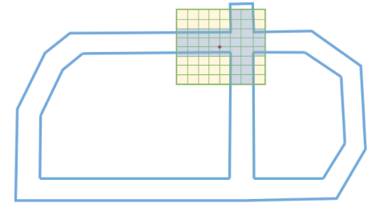

   

3. ROI LUT点查询

   检查点在ROI LUT矩形区域之内还是之外。
   查询LUT中相对于ROI关联点的相应单元格。
   收集属于ROI的所有点，并输出其相对于输入点云的索引。

###### 基于卷积神经网络分割（CNN Segmentation）

输入：高精地图 ROI过滤之后，在HDMap中定义的ROI内的点的点索引

输出：对应于ROI中的障碍物对象数据，例如汽车，卡车，自行车和行人。

处理：

​		1、通道特征提取：单元格中点的最大高度,单元格中最高点的强度,单元格中点的平均高度,单元格中点的平均强度,单元格中的点数,单元格中心相对于原点的角度,单元格中心与原点之间的距离,二进制值标示单元格是空还是被占用

​		2、基于卷积神经网络的障碍物预测，预测单元格障碍物属性，包括潜在物体中心的偏移位移（称为中心偏移）、对象性（是否是物体）、 积极性（是否为正目标）和物体高度。

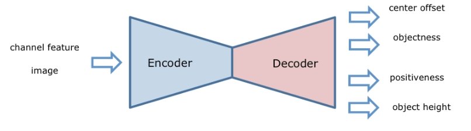

输入： *W* x *H* x *C* 通道图像

输出：中点，对象，积极性，高度

​		3、障碍物聚类     

为生成障碍物，Apollo基于单元格中心偏移，预测构建有向图，并搜索连接的组件作为候选对象集群。

Apollo采用压缩的联合查找算法（Union Find algorithm ）有效查找连接组件，每个组件都是候选障碍物对象集群。Apollo将非对象单元定义为目标小于0.5的单元格。因此，Apollo过滤出每个候选对象集群的空单元格和非对象集。

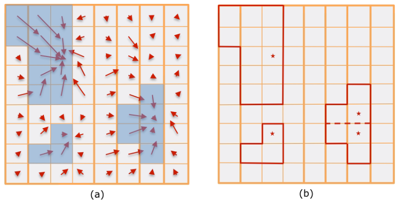

​		4、后期处理

聚类后，Apollo获得一组候选对象集，每个候选对象集包括若干单元格。

1、对所涉及的单元格的积极性和物体高度值，平均计算每个候选群体的检测置信度分数和物体高度。

2、Apollo去除相对于预测物体高度太高的点，并收集每个候选集中的有效单元格的点。 

3、Apollo删除具有非常低的可信度分数或小点数的候选聚类，以输出最终的障碍物集/分段。

###### MinBox 障碍物边框构建（MinBox Builder）

对象构建器组件为检测到的障碍物建立一个边界框。找到给定多边形点边缘的所有区域。

1、如果AB是边缘，则Apollo将其他多边形点投影到AB上，并建立具有最大距离的交点对，这是属于边框的边缘之一。

2、然后直接获得边界框的另一边。通过迭代多边形中的所有边，Apollo确定了一个边界边框，将选择具有最小面积的方案作为最终的边界框。

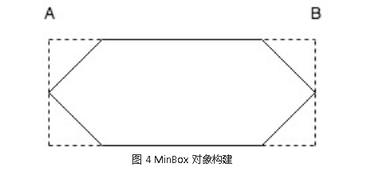

###### HM对象跟踪（HM Object Tracker）

HM对象跟踪器跟踪分段检测到的障碍物。通常，它通过将当前检测与现有跟踪列表相关联，来形成和更新跟踪列表，如不再存在，则删除旧的跟踪列表，并在识别出新的检测时生成新的跟踪列表。更新后的跟踪列表的运动状态将在关联后进行估计。

输入：障碍物数据

输出：更新的障碍物追踪列表

处理：

1、构造跟踪对象并将其转换为世界坐标，建立一个关联距离矩阵。根据一系列关联特征（包括运动一致性，外观一致性等）计算给定检测和一条轨迹之间的距离。HM跟踪器距离计算中使用的一些特征如下所示：

| 关联特征名称       | 描述           |
| ------------------ | -------------- |
| location_distance  | 评估运动一致性 |
| direction_distance | 评估运动一致性 |
| bbox_size_distance | 评估外观一致性 |
| point_num_distance | 评估外观一致性 |
| histogram_distance | 评估外观一致性 |

 还有一些重要的距离权重参数 ， 用于将上述关联特征组合成最终距离测量 

2、给定关联距离矩阵，Apollo构造了一个二分图，并使用 **匈牙利算法**通过最小化距离成本找到最佳的检测跟踪匹配。它解决了O(n^3)时间复杂度中的赋值问题。 为了提高其计算性能，通过删除距离大于合理的最大距离阈值的顶点，将原始的二分图切割成子图后实现了匈牙利算法。

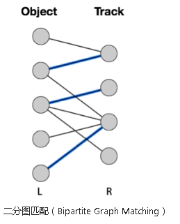


3、跟踪动态预估 （Track Motion Estimation）

在检测到跟踪关联之后，HM对象跟踪器使用 **鲁棒卡尔曼滤波器**（去除奇异值影响）来利用恒定速度运动模型估计当前跟踪列表的运动状态。 运动状态包括锚点和速度，分别对应于3D位置及其3D速度。 为了克服由不完美的检测引起的可能的分心，在跟踪器的滤波算法中实现了鲁棒统计技术。

##### 信号灯感知

输入：

​     不同摄像头的图像数据：
​          /apollo/sensor/camera/traffic/image_long
​           /apollo/sensor/camera/traffic/image_short
​     定位信息  /tf
​     高精地图
​     校准结果

预处理输出：

​       被选择的摄像头输出的的图像信息

​       从世界坐标系投射到图像坐标系的信号灯边界盒

处理：


​       调整 — 在ROI中检测信号灯边界盒  （CNN） 它接收带有ROI信息的图像作为输入数据，顺序输出边界盒。 

​       识别 — 鉴别边界盒的颜色 （CNN） 接收带有ROI信息的图像和一组边界盒信息作为输入数据。输出数据是一个`$4\times n$ vector`， 表示每个边界盒是黑色、红色、黄色和绿色的概率。 

​       修正 — 根据信号灯颜色的时间顺序关系修正颜色。如果接收到黑色或者未知，修正器会检测状态保存列表。如果信号灯状态已经确定持续了一段时间，那么将保存的状态输出。否则将黑色或者未知输出。因为时间顺序关系的存在，黄色只会在绿色之后红色之前出现，所以为了安全的考虑，在绿色出现之前任何红色之后的黄色都会被设置为红色。


输出： 一组带有颜色标签的边界盒信息 

##### Apollo 3.0 的感知

感知模块输入：

- 雷达数据（ROS主题*/ apollo / sensor / conti_radar*）
- 图像数据（ROS主题*/ apollo / sensor / camera / obstacle / front_6mm*）
- 雷达传感器校准的外部参数（来自YAML文件）
- 前置摄像头校准的外部和固有参数（来自YAML文件）
- 宿主车辆的速度和角速度（ROS主题/ apollo / localization / pose）

感知模块输出：

- 3D障碍物, 会跟踪航向，速度和分类信息（ROS主题*/ apollo / perception / obstacles*）

- 具有拟合曲线参数的车道标记信息，空间信息（l0，r0等）以及语义信息（车道类型）（ROS主题*/ apollo / perception / obstacles*）

  ```
  感知模块启停
  ./scripts/perception_lowcost_vis.sh start
  ./scripts/perception_lowcost_vis.sh stop
   Nvidia GPU和CUDA与Caffe一起运行感知模块   
  ```

  

### **2.3 预测prediction** 

— 预测模块预测感知障碍物的未来运动轨迹。

```
预测模块负责预测所有感知障碍物的未来运动轨迹。输出预测消息封装了感知信息。预测订阅定位和感知障碍物消息，如下所示。
当接收到定位更新时，预测模块更新其内部状态。当感知发出其发布感知障碍物消息时，触发预测实际执行。

AdaptorManager::AddPerceptionObstaclesCallback(&Precption::Runonce,this)
AdaptorManager::AddLocalizationCallback(&Precption::OnLocalization,this)
```


### **2.4 路由navigator** 

— 路由模块告诉自动驾驶车辆如何通过一系列车道或道路到达其目的地。

```
AdaptorManager::AddRoutingRequestCallback(&onRoutingRequest)
```


### **2.5 规划planning** 

— 规划模块规划自动驾驶车辆的时间和空间轨迹。

首先，规划模块获得预测模块的输出。预测输出封装了原始感知障碍物，规划模块订阅交通灯检测输出而不是感知障碍物输出。 然后，规划模块获取路由输出。在某些情况下，如果当前路由结果不可执行，则规划模块还可以通过发送路由请求来触发新的路由计算。

最后，规划模块需要知道定位信息（定位：我在哪里）以及当前的自动驾驶车辆信息（底盘：我的状态是什么）。规划模块由固定频率触发，主数据接口是调用`RunOnce`函数的`OnTimer`回调函数。

 底盘，定位，交通灯和预测等数据依赖关系通过`AdapterManager`类进行管理。核心软件模块同样也由`AdapterManager`类管理。例如，定位通过`AdapterManager :: GetLocalization()`管理，如下所示。 


### **2.6 控制control** 

— 控制模块通过产生诸如油门，制动和转向的控制命令来执行规划模块产生的轨迹。

如规划模块中所述，控制将规划轨迹作为输入，并生成控制命令传递给CanBus。它有三个主要的数据接口：OnPad，OnMonitor和OnTimer 

`OnPad`和`OnMonitor`是仿真和HMI的交互接口。 主要数据接口是`OnTimer`，它定期产生实际的控制命令，如下所示。

### **2.7 CanBus** 

— CanBus是将控制命令传递给车辆硬件的接口。它还将底盘信息传递给软件系统。

```


CanBus有两个数据接口。
第一个数据接口是基于计时器的发布者，回调函数为“OnTimer”。如果启用，此数据接口会定期发布底盘信息。
第二个数据接口是一个基于事件的发布者，回调函数为“OnControlCommand”，当CanBus模块接收到控制命令时会触发该函数。
```

### **2.8 高精地图** 

— 该模块类似于库。它不是发布和订阅消息，而是经常用作查询引擎支持，以提供关于道路的特定结构化信息。

### **2.9 定位localization** 

— 定位模块利用GPS，LiDAR和IMU的各种信息源来定位自动驾驶车辆的位置。

```
AdaptorManager::CreateTimer()
AdaptorManager::AddRawImuCallback()
AdaptorManager::AddPointCloudCallback()
AdaptorManager::GetGnssEph()
```

### **2.10 HMI** 

— Apollo中的HMI和DreamView是一个用于查看车辆状态，测试其他模块以及实时控制车辆功能的模块.

Apollo中的HMI或DreamView是一个Web应用程序： - 可视化自动驾驶模块的输出，例如，规划轨迹，汽车定位，底盘状态等。 - 为用户提供人机交互界面，以查看硬件状态，打开/关闭模块，以及启动自动驾驶汽车。 - 提供调试工具，如PnC Monitor，以有效跟踪模块问题。 

### **2.11 监控monitor** 

— 车辆中所有模块的监控系统包括硬件。

监控模块从其他模块接收数据并传递给HMI，以便司机查看并确保所有模块都正常工作。如果模块或硬件发生故障，监控会向Guardian（新的操作中心模块）发送警报，然后决定需要采取哪些操作来防止系统崩溃。 

### **2.12 Guardian哨兵**

 — 新的安全模块，用于干预监控检测到的失败和action center相应的功能。 执行操作中心功能并进行干预的新安全模块应监控检测故障。

这个新模块根据Monitor发送的数据做出相应决定。Guardian有两个主要功能： - 所有模块都正常工作 - Guardian允许控制模块正常工作。控制信号被发送到CANBus，就像Guardian不存在一样。 - 监控检测到模块崩溃 - 如果监控检测到故障，Guardian将阻止控制信号到达CANBus并使汽车停止。 Guardian有三种方式决定如何停车并会依赖最终的Gatekeeper——超声波传感器， - 如果超声波传感器运行正常而未检测到障碍物，Guardian将使汽车缓慢停止 - 如果传感器没有响应，Guardian会硬制动，使车马上停止。 - 这是一种特殊情况，如果HMI通知驾驶员即将发生碰撞并且驾驶员在10秒内没有干预，Guardian会使用硬制动使汽车立即停止。 


## 三、Apollo 主要模块说明

###  Canbus

输入：控制指令

输出：状态 

/modules/drivers/canbus
你通过CanClientFactory可以定制can_client

### Common

apollo_app，log， macro，adapters，configs/data，math，monitor，proto，status,time,util，vehicle_state (e.g. position, velocity,heading, etc.).

### data

 该模块包含用于Apollo的数据解决方案，包括用于处理诸如收集，存储，处理等场景的工具和基础结构。 

### control

  根据计划和当前的汽车状态，使用不同的控制算法来生成舒适的驾驶体验。控制模块可以在正常模式和导航模式下工作。 。 

输入：  规划轨迹，汽车状态，本土化，Dreamview AUTO模式更改请求
输出：底盘的控制命令（转向，油门，制动器）。

### localization

输入
GPS-全球定位系统。
IMU-惯性测量单元。
LiDAR-光检测和测距传感器。

输出
Protobuf消息定义的对象实例LocalizationEstimate，可以在文件中找到localization/proto/localization.proto。  

```
proto/localization_config.proto
modules/localization
FooLocalizatoin在Localization::RegisterLocalizationMethods()
localization_factory_.Register(LocalizationConfing::FOO, []()->LocalizationBase* { return new FooLocalization(); });

bash apollo.sh build。
```

### Perception

模块组织

```text
├── BUILD
├── Perception_README_3_5.md
├── README.md
├── base           // 基础类
├── camera         // 相机相关            --- 子模块流程
├── common         // 公共目录
├── data           // 相机的内参和外参
├── fusion         // 传感器融合
├── inference      // 深度学习推理模块
├── lib            // 一些基础的库，包括线程、时间等
├── lidar          // 激光雷达相关         --- 子模块流程
├── map            // 地图
├── model          // 深度学习模型
├── onboard        // 各个子模块的入口     --- 子模块入口
├── production     // 感知模块入口（深度学习模型也存放在这里）
                      --- 通过cyber启动子模块
├── proto          // 数据格式，protobuf
├── radar          // 毫米波雷达               --- 子模块流程
├── testdata       // 上述几个模块的测试数据
└── tool           // 离线测试工具
```


感知模块输入：

- 雷达数据（ROS主题*/ apollo / sensor / conti_radar*）
- 图像数据（ROS主题*/ apollo / sensor / camera / obstacle / front_6mm*）
- 雷达传感器校准的外部参数（来自YAML文件）
- 前置摄像头校准的外部和固有参数（来自YAML文件）
- 宿主车辆的速度和角速度（ROS主题/ apollo / localization / pose）

感知模块输出：

- 3D障碍物, 会跟踪航向，速度和分类信息（ROS主题*/ apollo / perception / obstacles*）

- 具有拟合曲线参数的车道标记信息，空间信息（l0，r0等）以及语义信息（车道类型）（ROS主题*/ apollo / perception / obstacles*）

  ```
  感知模块启停
  ./scripts/perception_lowcost_vis.sh start
  ./scripts/perception_lowcost_vis.sh stop
   Nvidia GPU和CUDA与Caffe一起运行感知模块   
  ```

### Planning

RTK重播规划首先在初始化中加载记录的轨迹，然后根据当前系统时间和车辆位置发送轨迹的正确片段。

EM规划中，将基于地图，路线和障碍物来计算驾驶决策和驾驶轨迹。首先使用基于DP（动态编程）的方法确定原始路径和速度曲线，然后使用基于QP（二次编程）的方法进一步优化路径和速度曲线以获得平滑的轨迹。

输入：

- RTK重播：
  - 定位
  - 记录的RTK轨迹（放入文件夹模块/ planning / data中，并在planning / common / planning_gflags中更改gflag文件名）
- EM：
  - 定位
  - 感知
  - 预测
  - 高清地图（在模块/地图/数据中）
  - 路由

输出：

- 无冲突且舒适的轨迹供控制模块执行。

### Prediction

预测模块以其基本感知信息（包括位置，航向，速度，加速度）从感知模块接收障碍物，并生成具有障碍物概率的预测轨迹。

输入
        感知模块的障碍
        定位

输出
        障碍物具有预测的轨迹


容器
        容器存储来自订阅频道的输入数据。当前支持的输入是感知障碍，车辆本地化和车辆规划。

评估者
        评估器会针对任何给定的障碍分别预测路径和速度。评估者使用存储在预测/数据/中的给定模型，通过输出路径的概率（通道序列）来评估路径。

```
成本估算器：概率是由一组成本函数计算得出的
MLP评估器：使用MLP模型计算概率
RNN评估器：使用RNN模型计算概率
```

预测器：预测器生成障碍物的预测轨迹。

```
预测器包括：
空：障碍物没有预测的轨迹
单车道：在高速公路导航模式下，障碍物沿单车道移动。不在车道上的障碍物将被忽略。
车道顺序：障碍物沿车道移动
移动顺序：障碍物按照其动力学模式沿车道移动
自由移动：障碍物自由移动
区域移动：障碍物在可能的区域中移动 
```

### Routing

路由模块根据请求生成高级导航信息。
路由模块取决于通常routing_map.*在apollo中命名的路由拓扑文件。
路由图可以通过命令生成    bash scripts/generate_routing_topo_graph.sh
输入
      地图数据
      路由请求（开始和结束位置）
输出
      路线导航信息


### DreamView

DreamView是一个web应用程序，提供如下的功能：

1. 可视化显示当前自动驾驶车辆模块的输出信息，例如规划路径、车辆定位、车架信息等。
2. 为使用者提供人机交互接口以监测车辆硬件状态，对模块进行开关操作，启动自动驾驶车辆等。
3. 提供调试工具，例如PnC监视器可以高效的跟踪模块输出的问题


## 四、使用VSCode构建、调试Apollo项目

###  构建

1、打开“Visual Studio Code”，执行菜单命令“文件->打开文件夹”，在弹出的对话框中，选择“Apollo”项目源文件夹，点击“确定” 

 2、令“任务->运行生成任务”或直接按快捷键“Ctrl+Shift+B”（与Visual Studio和QT的快捷键一致）构建工程，若之前没有启动过Docker，则编译时会启动Docker，需在底部终端窗口输入超级用户密码，如下图所示： 

 命令执行完毕，若在底部终端窗口出现“**终端将被任务重用，按任意键关闭。**”信息（如下图所示），则表示构建成功。整个过程一定要保持网络畅通，否则无法下载依赖包。 

3、配置任务

我在`.vscode/tasks.json`文件中总共配置了四个常见的任务：`build the apollo project`（构建Apollo项目）、`run all unit tests for the apollo project`（运行Apollo项目的所有单元测试）、`code style check for the apollo project`（Apollo项目的代码风格检查）、`clean the apollo project`（清理Apollo项目）。其中第一个任务是默认生成任务，可以直接按快捷键“Ctr+Shift+B”调用，其他任务可通过执行菜单命令：任务->运行任务(R)…

```
"tasks": [
        {
            "label": "build the apollo project",
            "type": "shell",
            // 可根据"apollo.sh"提供的选项来调整编译任务，例如：build_gpu
            "command": "bash apollo_docker.sh build",
            "group": {
                "kind": "build",
```

### 调试

1、docker内部安装gdbserver

```
sudo apt-get install gdbserver
```

2、 进入Docker，启动Dreamview

```
bash docker/scripts/dev_start.sh -C 
bash scripts/bootstrap.sh
```

## 五、高精度地图制作

### **采集**


lidar、摄像头、gnss、imu

需要的操作系统和软件：

1. ubuntu 16.04
2. apollo


 用apollo的录制bag功能，可以把传感器的数据都录制下来，提供生成高精地图的原始数据。 采集过程中需要多次采集来保证采集的数据比较完整，比如你在路口的时候，从不同的角度开车过去看到的建筑物的轮廓是不一样的，这些轮廓就是激光雷达扫描到的数据。所以遇到路口，或者多车道的情况，尽可能的多采集几次，才能收集到比较完整的地图信息。并且速度不要太快，apollo上的介绍是不超过60km/h（这里没有特别说明会出现什么问题）。 

### **融合与标注加工**

如何加工上述地图？

首先需要生成一张原始的地图，这里我们采用点云生成原始的地图，因为点云的距离位置信息比较准确，因为点云数据是0.1s采集一帧，下面我们可以做一个计算。如果车速是100km/h，对应27.8m/s。即0.1s车行驶的距离是2.78m，而激光雷达的扫描距离大概是150m，所以前后2帧大部分地方是重合的。因为数据是一帧一帧的，我们需要把上面的说的每一帧进行合并，生成一张完整的地图，有点类似全景照片拼接，这样我们就可以得到一张原始的采集路段的地图。这里用到了点云的配准技术，有2种算法**ICP**和**NDT**，基于上面的算法，可以把点云的姿态进行变换并且融合。

 点云拼接好了之后，我们就需要在道路上标出路沿，车道线，红绿灯，路口，一些交通标识等。大部分的工作都可以用深度学习结合图像的方法去解决，查找出上面的一些信息并且标识出来，目前有些场景还是需要人工标识出来，比如路口停止线和红绿灯的关系，如果一些特殊场景的车道线等，需要人工去做一些校正。 

高精度地图分为三层:

1. **地图图层** 地图图层主要是道路的信息，比如道路的路沿，车道线，路口信息，主要是道路的一些基本信息。
2. **定位图层** 定位图层主要是具备独特的目标或特征，比如红绿灯，交通标志，道路的点云数据等。
3. **动态图层** 动态图层主要是一些实时路况，修路或者封路等需要实时推送或者更新的数据

### 转换

转换主要是得到一个通用的自动驾驶系统可以使用的高精度地图。

上面的高精地图格式可能还是原始的数据格式，需要转换为apollo中高精度地图的格式，apollo中高精度地图采用了opendrive的格式，并且做了改进

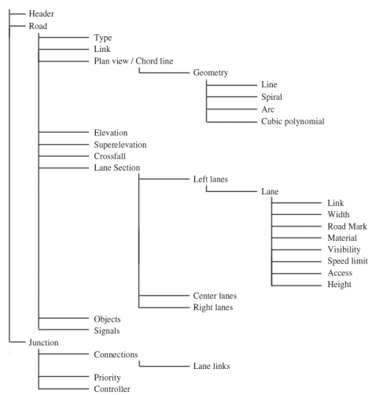

## 六、Apollo 计算框架 Cyber 

 Apollo的计算平台之前一直采用的是ROS进行通讯，3.5版本用Cyber替换了这一架构。

Cyber是一个分布式收发消息，和调度框架，同时对外提供一系列的工具和接口来辅助开发和定位问题。 Cyber 实现了

1. 消息队列 - 主要作用是接收和发送各个节点的消息，涉及到消息的发布、订阅以及消息的buffer缓存等。
2. 实时调度 - 主要作用是调度处理上述消息的算法模块，保证算法模块能够实时调度处理消息。

### **通信组件**

节点(Node):   每个节点有各自独立的算法程序，如点云预处理算法、障碍物检测算法等

信道(channel): 传输通道，单向

服务（Service) : 服务是另外一种通信方式，双向。

### **通信模式**

进程内，进程间，主机间

UDP 组播方式通知。每个进程的所有channel 都可以共用一个线程去获取可读通知。

### 运行流程

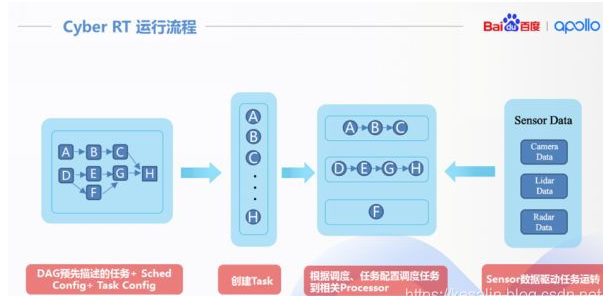

### **数据处理**

  

1. Node节点中的Writer往通道里面写数据。

2. 通道中的Transmitter发布消息，通道中的Receiver订阅消息。

3. Receiver接收到消息之后，触发回调，触发DataDispather进行消息分发。

4. DataDispather接收到消息后，把消息放入CacheBuffer，并且触发Notifier，通知对应的DataVisitor处理消息。

5. DataVisitor把数据从CacheBuffer中读出，并且进行融合，然后通过notifier_唤醒对应的协程。

6. 协程执行对应的注册回调函数，进行数据处理，处理完成之后接着进入睡眠状态。

   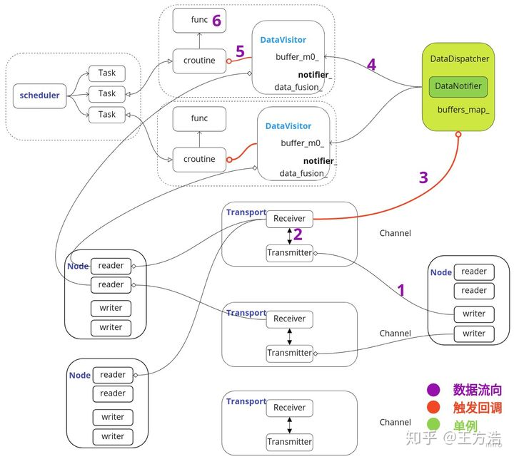

### 一些概念

**1.Component和Node的关系**

Component是cyber中封装好的数据处理流程，对用户来说，对应自动驾驶中的Planning Component, Perception Component等，目的是帮助我们更方便的订阅和处理消息。实际上**Component模块在加载之后会执行"Initialize()"函数**，这是个隐藏的初始化过程，对用户不可见。在"Initialize"中，Component会创建一个Node节点，概念上对应ROS的节点，**每个Component模块只能有一个Node节点**，也就是说每个Component模块有且只能有一个节点，在Node节点中进行消息订阅和发布。

**2.Node和Reader\Writer的关系**

在Node节点中可以创建Reader订阅消息，也可以创建Writer发布消息，每个Node节点中可以创建多个Reader和Writer。


**3.Reader和Receiver,Writer和Transmitter,Channel的关系**

一个Channel对应一个Topic，概念上对应ROS的消息通道，每个Topic都是唯一的。而Channel中包括一个发送器(Transmitter)和接收器(Receiver)，通过Receiver接收消息，通过Transmitter发送消息。

一个Reader只能订阅一个通道的消息，如果一个Node需要订阅多个通道的消息，需要创建多个Reader。同理一个Writer也只能发布一个通道的消息，如果需要发布多个消息，需要创建多个Writer。

Reader中调用Receiver订阅消息，而Writer通过Transmitter发布消息。


**4.Receiver, DataDispatcher和DataVisitor的关系**

每一个Receiver接收到消息之后，都会触发回调，回调中触发DataDispather（消息分发器）发布消息，DataDispather是一个单例，所有的数据分发都在数据分发器中进行，DataDispather会把数据放到对应的缓存中，然后Notify(通知)对应的协程（实际上这里调用的是DataVisitor中注册的Notify）去处理消息。

DataVisitor（消息访问器）是一个辅助的类，**一个数据处理过程对应一个DataVisitor，通过在DataVisitor中注册Notify（唤醒对应的协程，协程执行绑定的回调函数），并且注册对应的Buffer到DataDispather**，这样在DataDispather的时候会通知对应的DataVisitor去唤醒对应的协程。

也就是说DataDispather（消息分发器）发布对应的消息到DataVisitor，DataVisitor（消息访问器）唤醒对应的协程，协程中执行绑定的数据处理回调函数。


**5.DataVisitor和Croutine的关系**

实际上DataVisitor中的Notify是通过唤醒协程（为了方便理解也可以理解为线程，可以理解为你有一个线程池，通过线程池绑定数据处理函数，数据到来之后就唤醒对应的线程去执行任务），每个协程绑定了一个数据处理函数和一个DataVisitor，数据到达之后，通过DataVisitor中的Notify唤醒对应的协程，执行数据处理回调，执行完成之后协程进入休眠状态。


**6.Scheduler, Task和Croutine**

通过上述分析，**数据处理的过程实际上就是通过协程完成的，每一个协程被称为一个Task，所有的Task(任务)都由Scheduler进行调度**。从这里我们可以分析得出实际上Cyber的实时调度由协程去保障，并且可以灵活的通过协程去设置对应的调度策略，当然协程依赖于进程，Apollo在linux中设置进程的优先级为实时轮转，先保障进程的优先级最高，然后内部再通过协程实现对应的调度策略。
